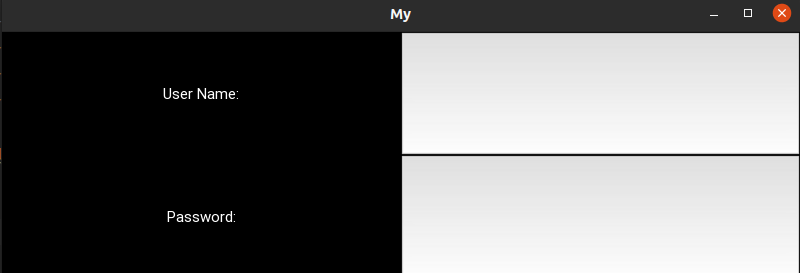
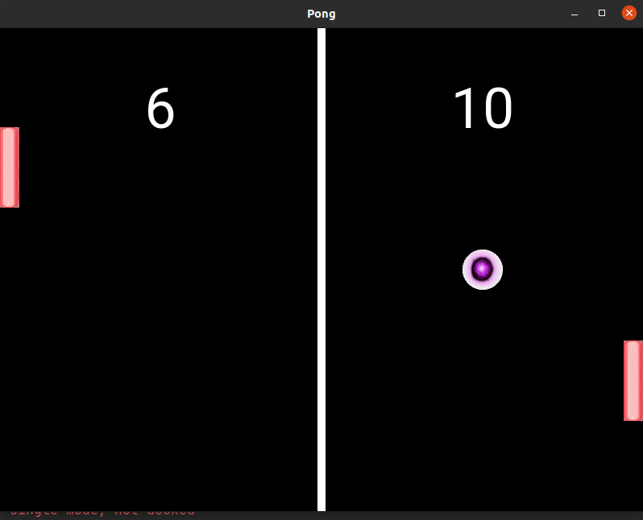

Kivy Examples
======================

This is some Kivy examples to get started with it.

1. First example is a hello world one. It's basically a login form with two labels and two text boxes

2. Second example is ping pong game, with two players and every one has a score, and the ball serve is random, which means every round the ball goes to a random payer

Inspiration
-----------
This was inspired by `Dev Dungeon's Video <https://www.youtube.com/watch?v=GXP8O4dSS3E>`_

